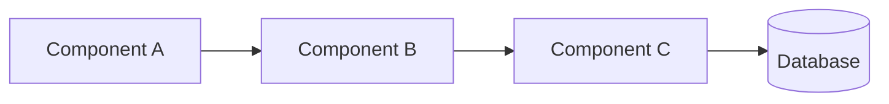

# Design Document

## Overview

[1-2 paragraphs describing what this feature does, the problem it solves, and the high-level approach. Include what is explicitly out of scope.]

## Architecture

[How this feature fits into the existing system. Include integration points and key architectural decisions.]



### Key Decisions

| Decision | Rationale |
|----------|-----------|
| [Choice made] | [Why this choice was made] |

## Components and Interfaces

### [Component Name]

[Description of the component's responsibility]

**Interface:**
```
methodName(param: Type): ReturnType
anotherMethod(param: Type): ReturnType
```

**Dependencies:** [List of dependencies]

---

### [Another Component]

[Description]

**Interface:**
```
methodName(param: Type): ReturnType
```

## Data Models

### [Entity Name]

| Field | Type | Constraints | Description |
|-------|------|-------------|-------------|
| id | UUID | Primary key | Unique identifier |
| [field] | [type] | [constraints] | [description] |

### API Contracts

**Request:**
```json
{
  "field": "value"
}
```

**Response:**
```json
{
  "field": "value",
  "status": "success"
}
```

## Error Handling

| Scenario | Error Code | Response | Recovery |
|----------|------------|----------|----------|
| [Error case] | [Code] | [Message] | [How to recover] |

### Logging Strategy

- [What gets logged and at what level]

## Testing Strategy

### Unit Tests

- [Component]: [What to test]
- [Component]: [What to test]

### Integration Tests

- [Scenario to test end-to-end]
- [Another integration scenario]

### Edge Cases

- [Edge case 1]
- [Edge case 2]
