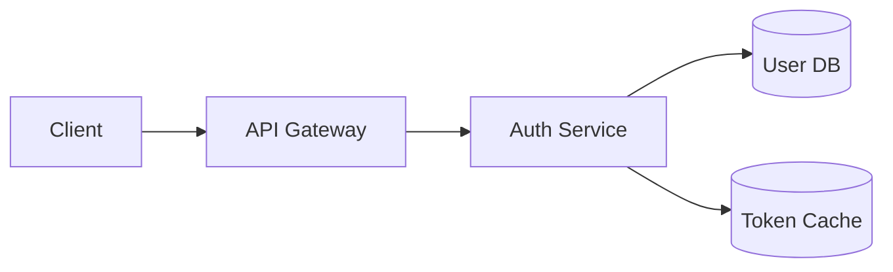

# Design Document Sections

Each design document should include these sections, adapted to the feature's complexity.

## 1. Overview

Brief summary of what the feature does and why it exists.

**Include:**
- Problem being solved
- High-level approach
- Key benefits
- Scope boundaries (what's NOT included)

**Example:**
```markdown
## Overview

This feature adds JWT-based authentication to the API, enabling secure 
stateless sessions. Users can log in with email/password and receive 
tokens valid for 24 hours.

Out of scope: OAuth providers, password reset flow, MFA.
```

## 2. Architecture

How the feature fits into the existing system.

**Include:**
- System context diagram (Mermaid recommended)
- Key architectural decisions
- Integration points with existing code
- New services or components introduced

**Example Mermaid diagram:**


## 3. Components and Interfaces

Detailed breakdown of new code components.

**Include:**
- Component responsibilities
- Public interfaces/APIs
- Dependencies between components
- Key method signatures

**Format:**
```markdown
### AuthService
Handles user authentication and token management.

**Interface:**
- `login(email, password): Promise<TokenPair>`
- `refresh(refreshToken): Promise<AccessToken>`
- `validate(accessToken): Promise<User>`

**Dependencies:** UserRepository, TokenCache, PasswordHasher
```

## 4. Data Models

New or modified data structures.

**Include:**
- Entity definitions with types
- Database schema changes
- API request/response shapes
- Validation rules

**Format:**
```markdown
### User Entity
| Field | Type | Constraints |
|-------|------|-------------|
| id | UUID | Primary key |
| email | string | Unique, required |
| passwordHash | string | Required |
| createdAt | timestamp | Auto-generated |
```

## 5. Error Handling

How the feature handles failure cases.

**Include:**
- Expected error scenarios
- Error response format
- Recovery strategies
- Logging approach

**Format:**
```markdown
### Error Scenarios

| Scenario | Response | Recovery |
|----------|----------|----------|
| Invalid credentials | 401 Unauthorized | Prompt retry |
| Expired token | 401 + "token_expired" code | Auto-refresh |
| Rate limited | 429 Too Many Requests | Exponential backoff |
```

## 6. Testing Strategy

How the feature will be tested.

**Include:**
- Unit test coverage targets
- Integration test scenarios
- Edge cases to verify
- Test data requirements

**Format:**
```markdown
### Unit Tests
- AuthService.login: valid credentials, invalid password, user not found
- TokenValidator: valid token, expired token, malformed token

### Integration Tests
- Full login flow with database
- Token refresh cycle
- Concurrent session handling

### Edge Cases
- Clock skew handling for token expiration
- Unicode characters in passwords
```

## Complexity Adaptation

**Simple features:** Overview + Components + Testing may suffice

**Complex features:** All sections, plus consider adding:
- Performance Considerations
- Security Analysis
- Migration Strategy
- Rollback Plan
